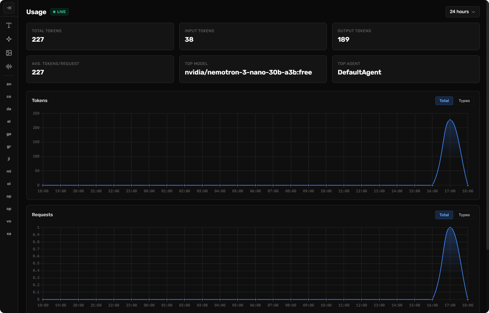

# Laravel AI Usage

[](https://packagist.org/packages/harlew-dev/laravel-ai-usage)
[](https://github.com/harlew-dev/laravel-ai-usage/actions/workflows/run-tests.yml)
[](https://packagist.org/packages/harlew-dev/laravel-ai-usage)

Real-time AI usage, token, and cost monitoring dashboard for the Laravel AI SDK. Automatically tracks token consumption, costs, and usage patterns across all AI providers with a beautiful Livewire-powered dashboard.



## Installation

You can install the package via composer:

```bash
composer require harlew-dev/laravel-ai-usage
```

You can publish and run the migrations with:

```bash
php artisan vendor:publish --tag="ai-usage-migrations"
php artisan migrate
```

You can publish the config file with:

```bash
php artisan vendor:publish --tag="ai-usage-config"
```

## Usage

Once installed, the package automatically listens to Laravel AI SDK events and records token usage and costs for every AI call your application makes.

Visit `/ai/usage` in your browser to access the dashboard.

### Authorization

By default, the dashboard is only accessible in the `local` environment. To configure access in other environments, define an `viewAiUsage` gate in your `AuthServiceProvider`:

```php
Gate::define('viewAiUsage', function ($user) {
    return in_array($user->email, [
        // authorized emails
    ]);
});
```

## Testing

```bash
composer test
```

## Changelog

Please see [CHANGELOG](CHANGELOG.md) for more information on what has changed recently.

## Contributing

Please see [CONTRIBUTING](https://github.com/harlew-dev/.github/blob/main/CONTRIBUTING.md) for details.

## Security Vulnerabilities

Please review [our security policy](../../security/policy) on how to report security vulnerabilities.

## Credits

- [Harlew](https://github.com/harlew-dev)
- [All Contributors](../../contributors)

## License

The MIT License (MIT). Please see [License File](LICENSE.md) for more information.
